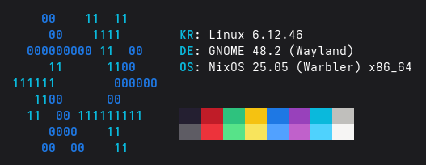

# NixOS ASCII Logo


## Small one


### Neofetch
```ascii
     ${c1}00    ${c2}11  11
      ${c1}00    ${c2}1111
   ${c1}000000000 ${c2}11  ${c1}00
      ${c2}11      11${c1}00
 ${c2}111111        ${c1}000000
    ${c2}11${c1}00      00
   ${c2}11  ${c1}00 ${c2}111111111
      ${c1}0000    ${c2}11
     ${c1}00  00    ${c2}11
```
Author: [George Noise](https://github.com/George-Noise)  
preview  



### Just text
```ascii
     00    11  11
      00    1111
   000000000 11  00
      11      1100
 111111        000000
    1100      00
   11  00 111111111
      0000    11
     00  00    11
```
Author: [George Noise](https://github.com/George-Noise)  
